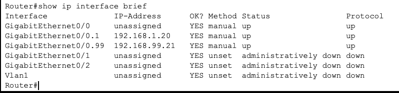
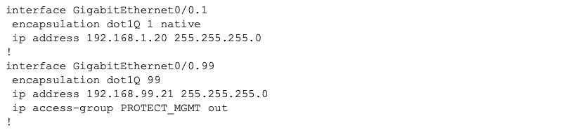
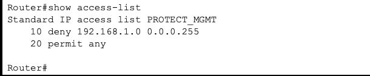

# Secure-VLAN-Segmentation
Cisco Packet Tracer Lab: Implementing Router-on-a-Stick with Management Plane Hardening (ACLs)  
Author: Iris Hernandez  
Technology: Cisco Packet Tracer, 802.1Q Trunking, Standard ACLS  

## Project Overview
This project demonstrates the implementation of a Router-on-a-Stick topology designed to secure and segment a corporate network's management infrastructure. By creating a dedicated Management VLAN (VLAN 99) and enforcing a Standard Access Control List (ACL) at the sub-interface level, I successfully isolated critical management traffic from the general user segment. This implementation ensures a "Zero-Trust" approach to network administration, preventing unauthorized lateral movement while maintaining full administrative reachability.

## Issues and Troubleshooting  
### Physical Interface Activation & "Parent-Child" Hierarchy  
While configuring the router-on-a-Stick, the logical sub-interfaces (G0/0.1 & G0/0.99) remained in a down state despite having correct IP addresses.  
####  The Diagnoses: 
I executed the show ip interface brief command to audit the status of all the ports. Here is where I noticed that GigabitEthernet0/0 was administratively down, meaning the physical port was locked; therefore, the subinterfaces under the port were also down.  
#### The Solution: 
I then went to the G0/0 configuration mode and implemented the no shutdown command, which opened the interface and all subinterfaces.  
#### Verification: 
To ensure changes were properly saved, a second status check was run, and user gateways were fully operational.  

### Layer 2 Encapsulation Requirement (802.1Q)  
When attempting to assign IP addresses to the sub-interfaces before defining the encapsulation type, I was given an error.  
#### The Diagnoses: 
The router was rejecting the IP address due to the OSI model hierarchy. A sub-interface lacks a physical state, meaning its data link layer parameters must be manually configured to handle 802.1Q encapsulation before Network Layer attributes can be assigned. In other words, Layer 3 (IP) cannot be initialized because Layer 2 (802.1Q) has not yet been defined to handle the tagged frames. Since a sub-interface is a logical entity, the router requires a protocol to "bind" that virtual slice to a specific VLAN before it can accept an IP address.  
#### The Solution: 
To resolve the configuration issue, I implemented 802.1Q(dot1q) encapsulation on each sub-interface. This provided the necessary Layer 2 "rulebook" that the router requires before it can process Layer 3 (IP) traffic.  
#### Verification: 
After configuration, I ensured the router could ping the switch (VLAN 99) and other devices from VLAN 1 could not ping the switch.  
The following command was executed on the router to ensure encapsulation was properly installed on sub-interfaces: show running-config  
*NOTE: VLAN 1 was designated as the Native VLAN for untagged control traffic, while VLAN 99 utilized explicit 802.1Q tagging for management data*  

### Core Configuration: Access Control List (ACL)  
In order to enforce the concept of zero trust boundary and a clear boundary between the data/user and network/management plane, I implemented a standard ACL. This acts as a security filter at layer 3. 

### Future Hardening Recommendations:
1) Change the native VLAN 1 (default) to another VLAN to avoid VLAN hopping attacks via double-tagging.
2) Enforce SSH for encryption.

### Design Philosophy: Minimalist Functional Design
This project focuses on Depth over scale. Rather than building a complex topology with redundant devices, I utilized a minimalist architecture to demonstrate mastery of Inter-VLAN routing and Layer 3 security policies. This ensures that the technical focus remains on the precision of the configuration and the effectiveness of the security hardening.

## Security Note: 
In a production environment, I would ensure that only the necessary sub-interfaces were brought up, following the Principle of Least Privilege to minimize the network's attack surface.
